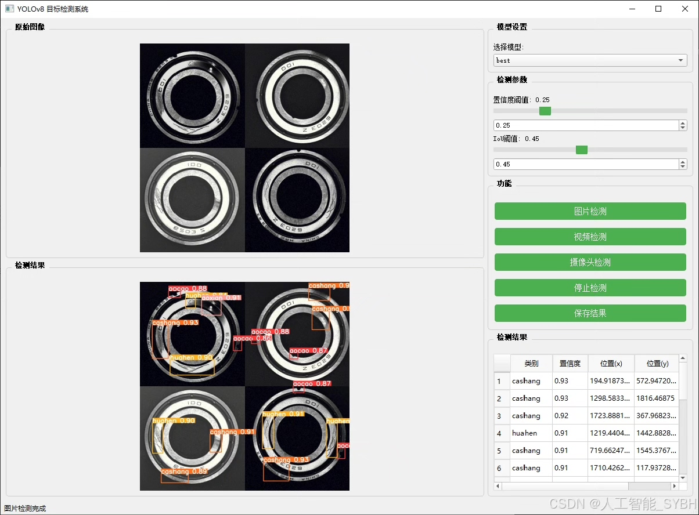
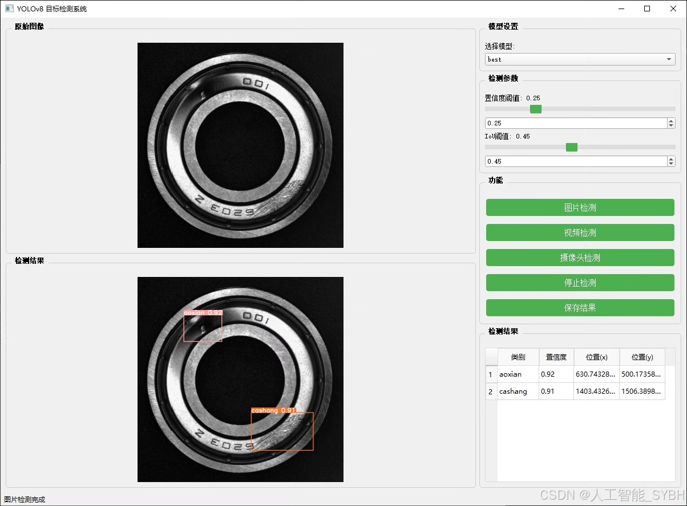
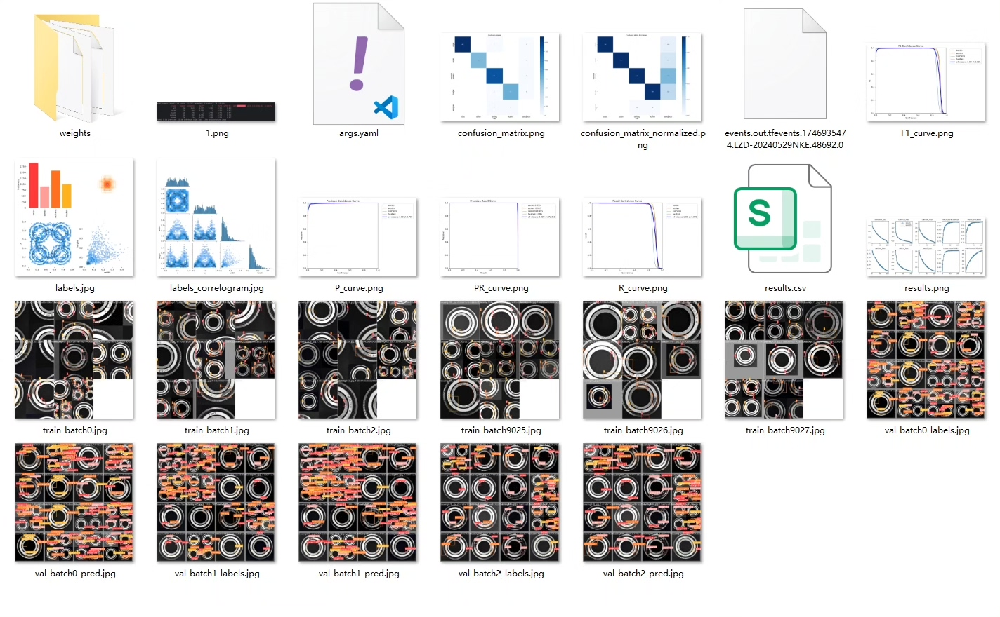
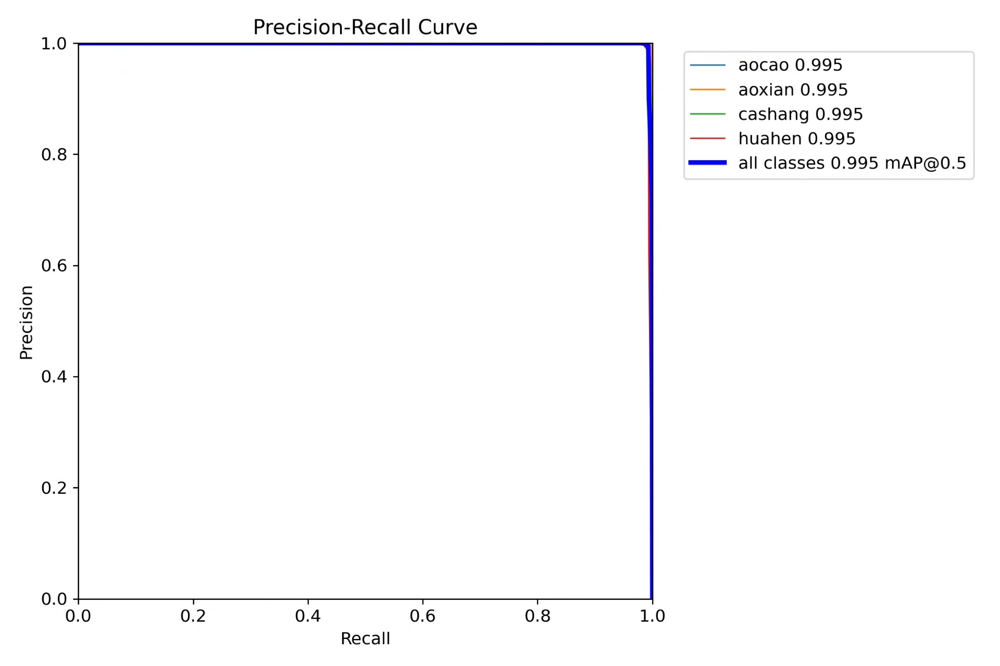
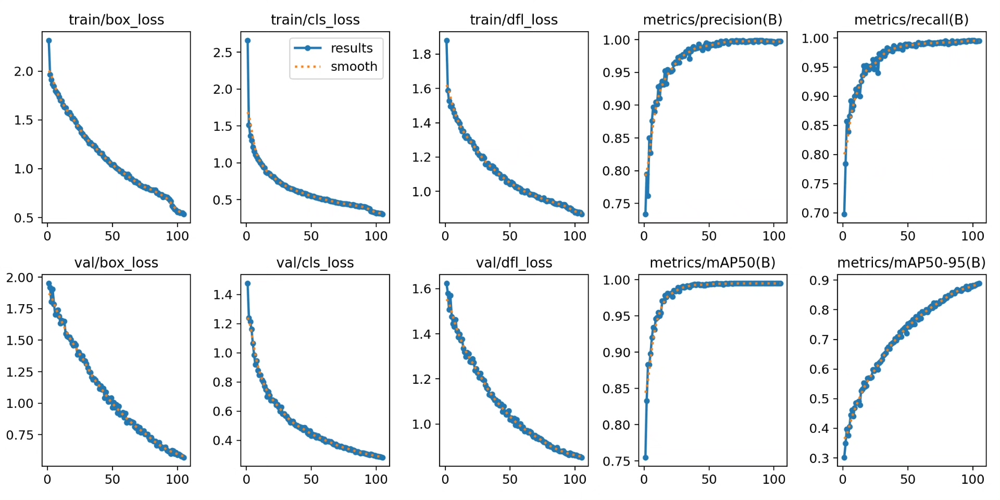
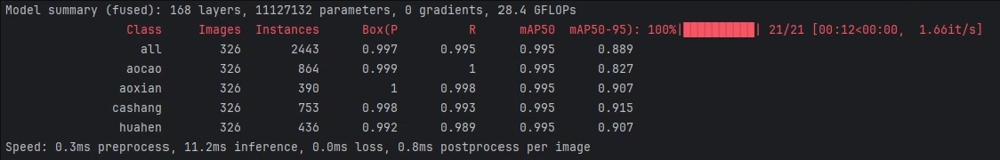
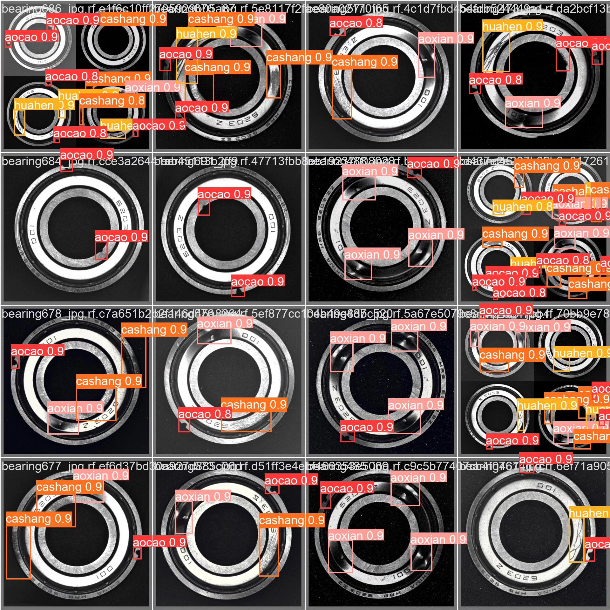

# Bearing Defect Detection System Based on Deep Learning YOLOv8+Y

## Body

This project is based on the advanced YOLOv8 object detection algorithm, developing an efficient automatic detection system for surface defects of bearings. The system recognizes and classifies four common types of bearing defects (pits, grooves, scratches, and scratches) using a dataset containing 1085 labeled images (759 training set, 326 validation set). The system can detect surface defects of bearings in real-time, accurately identify defect types, and locate the location of defects, providing an intelligent solution for quality inspection of bearings in industrial production. Through the application of deep learning technology, this system significantly improves the efficiency and accuracy of bearing defect detection compared to traditional manual detection methods, showing obvious advantages over them.

The company's products have obtained the official commercial license certification from YOLO.

We provide after-sales service.

After payment, we will provide WeChat ID for any questions.

Environment configuration: We will provide a tutorial on environment configuration, and WeChat will provide answers to questions.

Remote installation service: If you need remote configuration, an additional fee of 69 is required, with all fees refunded if the configuration fails (only refunding installation fees for old computers).

Retraining dataset: After setting up the environment, you can train on your own computer. If you need us to retrain, just pay 69 plus computing power fees (2.5 yuan/hour).

Full after-sales service

## Images

## Payment

Here is a pay link on Stripe ( https://buy.stripe.com/3cs8yP7sY87d0vu9AB ). Please contact me lonlonago@foxmail.com after funding $89, and I will send you a complete data files , thank you!

